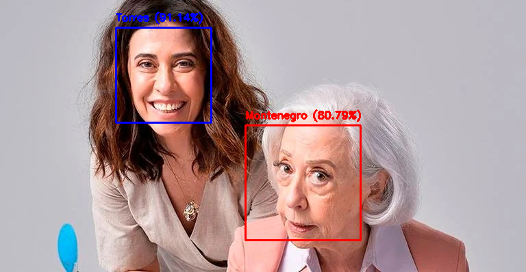

## Reconhecimento facial baseado em transfer learning: Fernanda Montenegro e Fernanda Torres

## Descrição
Este projeto implementa um modelo de reconhecimento facial baseado em **Transfer Learning**, utilizando o modelo **MobileNetV2** para classificar imagens das atrizes **Fernanda Montenegro** e **Fernanda Torres**. O objetivo é explorar técnicas de **Deep Learning** e **aprendizado por transferência**.

## Tecnologias Utilizadas
- Python
- TensorFlow/Keras
- OpenCV
- NumPy
- Google Colab

## Estrutura do Projeto
```
fs_detector_model/
│-- assets/
│     │-- montenegro_e_torres.jpg      # Imagem de teste para previsão 
│     │-- resultado.png                # Resultado da rede neural  
│-- dataset/                           # Diretório contendo as imagens de treino e validação
│-- fs_detector_model.ipynb            # Notebook Jupyter com todo o código
│-- fs_detector_model.h5               # Modelo treinado salvo
```

## Como Executar

> Atenção: para utilizar este caderno jupyter, é necessário usar o ambiente do Google Colab.

## Treinamento do Modelo
1. **Carregamento do MobileNetV2**
   - O modelo base é carregado sem a camada de classificação final.
   - Camadas personalizadas são adicionadas para adaptar ao problema.
2. **Configuração da Rede Neural**
   - Camada de pooling global.
   - Camada densa com 1024 neurônios (ReLU).
   - Camada de saída com duas classes (Softmax).
   - Camadas do MobileNetV2 são congeladas para preservar os pesos pré-treinados.
3. **Pré-processamento de Imagens**
   - Aumento de dados usando `ImageDataGenerator`.
   - Normalização dos valores dos pixels.
4. **Treinamento**
   - O modelo é treinado por 10 épocas usando `Adam` como otimizador e `categorical_crossentropy` como função de perda.
5. **Salvamento do Modelo**
   - O modelo final é salvo no arquivo `fs_detector_model.h5` para futuras previsões.

## Testando o Modelo
1. **Carregar o modelo salvo**
   ```python
   from tensorflow.keras.models import load_model
   model = load_model('fs_detector_model.h5')
   ```
2. **Realizar previsão em uma imagem**
   ```python
   import cv2
   import numpy as np
   
   image = cv2.imread('montenegro_e_torres.jpg')
   image_array = np.expand_dims(image, axis=0) / 255.0
   
   predictions = model.predict(image_array)
   ```
3. **Exibir a classe predita**
   ```python
   class_indices = {'Montenegro': 0, 'Torres': 1}
   classes = {v: k for k, v in class_indices.items()}
   
   predicted_class = classes[np.argmax(predictions)]
   confidence = np.max(predictions)
   
   print(f"Previção: {predicted_class} com confiança {confidence:.2f}")
   ```
4. **Visualização do resultado com OpenCV**
   - A imagem é processada para detecção de rostos usando o classificador Haar Cascade.
   - Cada rosto é classificado e rotulado na imagem com sua respectiva confiança.
   - Exibição da imagem anotada com `cv2_imshow()` no Google Colab.

## Resultado do modelo



## Licença
Este projeto está licenciado sob a **MIT License**. Consulte o arquivo `LICENSE` para mais informações.

---
Desenvolvido por **Eric dos Santos** - 2024

